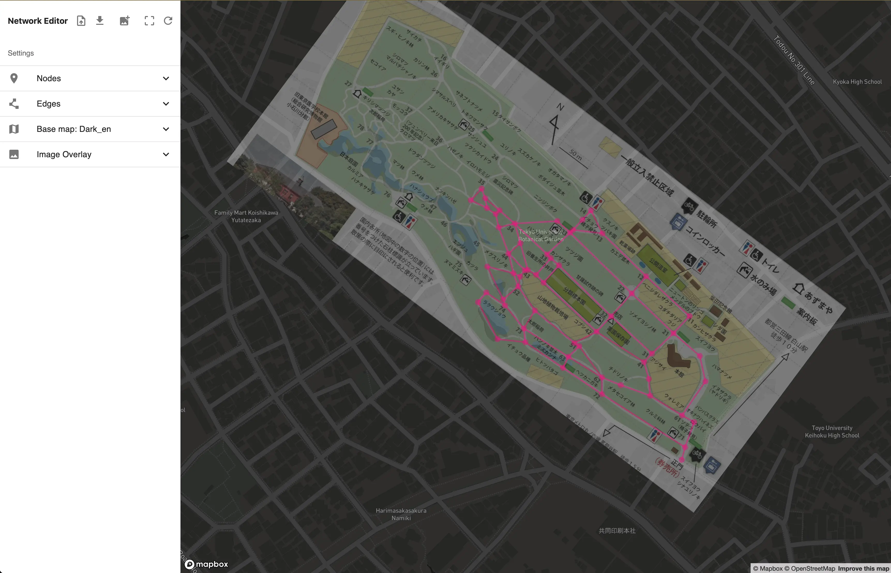

# Network editor on map

Easily edit networks with latitude and longitude metadata directly on an interactive web map.

https://sw1227.github.io/network-editor/map/

## Features
- **Interactive Web Map**: Edit networks composed of nodes and edges directly on a standard web map. Zoom, pan, and create with just a click.
- **Coordinate Conversion**: Overlay XY-based plan diagrams on a latitude-longitude based map through conversion between geographic and planar coordinates.
- **Comprehensive Network Data**: Networks maintain connectivity data between nodes, with each node also holding latitude and longitude information.
- **Export & Import**: Export your edited networks in Node-link JSON or GeoJSON formats. Import your saved JSON files to continue editing.

